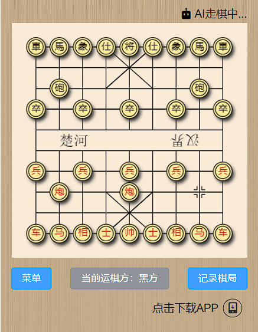

# 基于大数据的象棋人工智能

目标：基于大数据的象棋人工智能。
人类作为红方先走棋，AI作为黑方根据人类走棋后的棋局状态做出相应的走棋策略，以尽可能战胜人类为依据。

## 项目演示链接
中国象棋网页链接：
https://chess.stm32-mqtt.top

中国象棋APP下载链接:
https://chess.stm32-mqtt.top/zhchess.apk

## 主要工作
* 前端：
使用框架：zh-chess、Element-plus

导入zh-chess框架：npm i zh-chess canvas -D

具体实现：在onMounted生命周期中实例化对象game，监听move、over等状态，在MoveCallback回调中执行update方法更新棋盘

* 数据处理
使用技术：Selenium。

棋谱数据来源：http://game.onegreen.net/chess/。

具体实现：使用Selenium模拟用户访问该棋谱网站并获得该页面HTML源代码，再通过正则表达式获取该局红黑双方下棋动作列表movelist并将收集到的数据写入xlsx文件。该网页数据获取完毕后，模拟点击网页上局棋谱，收集其他棋局数据，直至数据全部收集完毕。

* 后端
框架选择：FastAPI （FastAPI 是一个用于构建 API 的现代、快速（高性能）的 web 框架）

该项目中使用FastAPI编写了两个接口。
1./predictChessAction/{chessboard_status}    GET请求
• 作用：该接口接收一个棋局状态作为路径参数，用于预测下一步最可能的棋子移动。
• 预测下一步棋子移动的实现细节：通过Pyspark使用Spark的强大统计功能来处理大规模数据集。
① 创建SparkSession，用于读取和处理数据。
② 读取chessboard.csv文件，重命名列名为更有意义的名称：棋盘状态、预测的棋子移动、预测棋子移动后棋盘状态。
③ 根据棋盘状态过滤数据，只保留匹配的行。
④ 对过滤后的数据进行分组，统计每个预测棋子移动出现的次数并存储在count列。
⑤ 根据count列降序排序，使出现次数最多的预测棋子移动排在最前。
⑥ 将处理后的DataFrame转换为JSON格式返回。

2./recordChessStatus        POST请求 
• 作用：该接口用于记录棋子移动后的棋盘状态。
• 参数：json类型：{
  "chessboardStatus": "string",
  "predictAction": "string",
  "chessboardStatusAfterPredictAction": "string",
}
• 后端成功收到参数后会将收到的数据写入chessboard.csv文件。

## 如何开始
1. 克隆本仓库：`git clone https://github.com/jynba/chess_project.git`
2. 进入项目目录：`cd chess_project`

## 贡献与许可

欢迎贡献！如果你有改进或新功能的想法，请提交 pull request。

本项目基于 MIT 许可证 进行开源。

